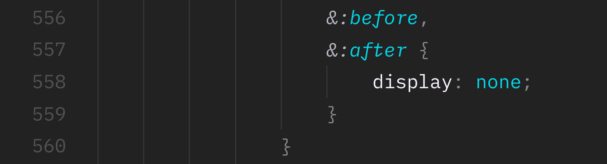
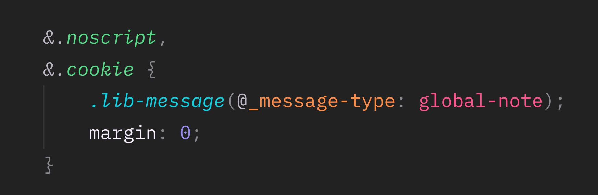
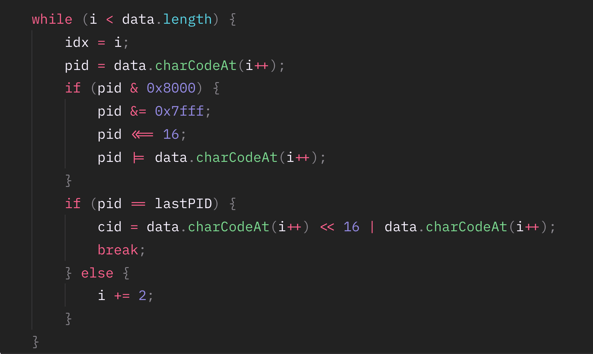

# Odorless frontend

Date: October 15, 2018

I have seen some truly terrifying code in the course of my professional life. When you see such a code, all you want to do is to leave the project, hide in a corner and cry.

Today I will tell you some basic rules following which you can simplify your work on the front end as well as make your colleagues a little happier.

Since the article contains quite a large amount of negativity, I’d like to offer you a compensation in the form of a cute red panda. By the way, this animal was used on Mozilla’s Firefox browser logo. Just FYI.

## Don’t use float

Seriously, don’t. Yes, it provides the support of IE10, but you will hardly need it. It’s really difficult to edit float layouts since any changes can break them, and it takes too long to fix it afterwards. It hurts me almost physically to see a float layout. Float was exactly the reason why a meme about wonderful CSS showed up.

If your site sells sneakers or smartphones feel free to use Grid. If you need IE11 support, use Flexbox. This is not difficult at all, there is a guide to it available on CSS–Trick.

## Go easy on the preprocessors

Let’s play a game. Guess which selector will be generated as a result of processing this code:

To understand the final selector, you need to go 400 lines up and study the structure of the code for a couple of minutes. This is not cool, CSS should not be like this. Do not use more than one level of nesting.

Now try to guess what parameters this macro will generate:

To do this, you will have to look for the file where this macro is declared. The use of this macro may be a part of Magento–Way, but still you should not use it.

Sometimes macros can be useful and it’s difficult to abandon them completely, so here is what I can suggest instead: use only the macros that are declared and used in the same file.

But the main thing that helped preprocessors to become so popular among web designers are variables. Please do not use preprocessor variables. If you need variables — use Custom Properties. Unlike variables, it’s easy to debug them in a browser. Also, you can change them directly in runtime, thus implementing the color schemes. The support is not that great, however, the autoprefixer knows how to polyfill them just as well as the preprocessors.

## Encapsulate styles

This tip applies to both the styles and the style files. Do not use global styles, otherwise, when editing you will have to track the changes in the whole cascade.

Extract the component code to a separate file. It is much more convenient to edit a file with 50 lines, not 5000.

## Do not abbreviate class names

You won’t win much in the size of files, but this will greatly damage readability.
Although some abbreviations seem obvious to you, others may not be able to understand them, so no `btnMidLPad`.

## Neither should you do the opposite

`another-one-selector-for-my-great-button__let-it-be-green` is not a good idea too.

## Do not mess with the global names

Don’t write anything to global variables. This is just as unreliable as Monkey Patching. Oh yes, do not modify global objects. There was Prototype.js that did exactly that, but it doesn’t mean that it’s worth doing. The debugging of such a code reminds me of an examination of bears by a neurologist.

## Do not write vendor prefixes

You won’t be able to remember all the prefixes, so don’t complicate the code too much and use the autoprefixer in the build system.

## Comment the code

If you have written an ingenious algorithm that performs its function perfectly, do not be lazy to write a comment on how and why it works, since others may not be able to understand the idea.

## First CSS, then JS

CSS is great because it is not a programming language. This is a markup language, and its methods of work are isolated and are constantly improved by browser developers.

If you need to make a popup in the center of a page, do not write a mathematical calculation of the indent from the top element. Instead, make a full-screen Flex-container and add the `align-items: center` property.

The less software logic a product has, the easier it is to be maintained.

## Clean up after yourself

Do not leave unnecessary functions, files and logs. The next developer will have to spend some time to figure out that this is garbage. Format the code before it’s committed.

## Divitis

Not all frontenders know this, but there are more than two HTML tags. Study the specification and use the tags as intended. There is a nav tag for navigation, and article tag for the content part. There must be a title inside the article, otherwise they will work as div.

If you think that accessibility is not what your projects need, then you are most likely wrong. I recommend reading about accessibility in Smashing Magazine.
