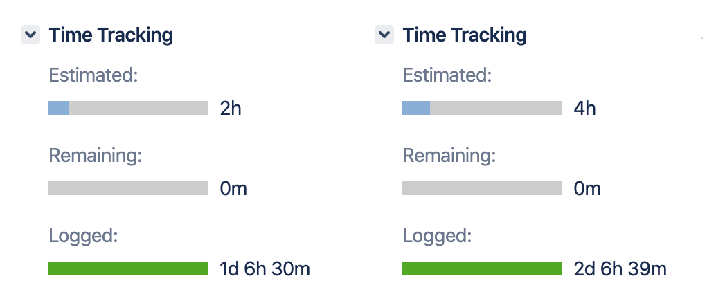

# Tests for dummies

Date: September 8, 2019

> A QA engineer walks into a bar one day.
> Runs into a bar.
> Sneaks into a bar.
> Dancing, gets into a bar.
>
> and orders: a mug of beer, 0 mugs of beer, 900000000 mugs of beers, -1 mug of beer, a lizard in a glass, `drop table 'mug'` of beer. At the launch, the users come in and ask where the toilet is. The bar explodes.

As you guessed, I'll tell you about the testing.

Everyone loves tests. Managers love the sense of stability that these tests give.  Developers like to write them, well, because it's funny. But at the same time, everyone hates the tests. Developers because until you understand all the subtleties of testing methods and your test framework - you will wonder why tests are falling, and managers because this is an extra time that developers spend.

I realized the importance of tests when doing the tasks, we exceeded the initial assessment and the manager decided to reduce the development time by throwing out tests.

So what happened next? Multiple time overruns due to constant bug fixes.

What are the tests for, anyway?
1. Increase the likelihood that the application will work.
2. Make sure it meets the specified requirements.
3. Keep the old bugs from coming back.
4. Fun :)

Testing is divided into an infinite number of categories and types, I see no point in telling about all, so I will highlight the most important.

In general, there are two abstract categories:

* Functional — checks which functions of the product are implemented and how correctly they are.
* Non-functional - checks how the product works.

## Non–functional tests

|              |                                                              |
| -------------| ------------------------------------------------------------ |
| **Security**     | Penetration tests, attempts to disrupt the integrity of the system through a fabricated request and other things from white–hat hackers. |
| **Localization** | Checks translation and data formatting.                      |
| **System**       | Checks interaction of different system elements. For example, if you press a button on the frontend which will request a backend, it is quite a system test. |
| **Smoke**        | Checks that critical functions are working as expected and more in-depth checks can be performed. |
| **Sanity**       | Checks that the code changes that are made are working as properly. |
| **UI/UX**        | It's not only how much the final product looks like what the designer painted, it's also an accessibility test. That is, if a person comes to your site with a screen reader and without a mouse, will he be able to achieve his goal? |
| **Performance**  | Checks product stability while load is high.                 |

An interesting story about smoke testing: The name of this method comes from the engineering. When a new device was put into operation, it was believed that testing was successful if no smoke came from the installation.

## Functional tests

|             |                                                              |
| ----------- | ------------------------------------------------------------ |
| **Unit**        | Checks whether a function or other minimum unit is working   |
| **Integration** | Checks that the module bundle within a product subsystem is working properly. |

## Example

We have a web service with a user interface and RESTful API. As QA's, we know:

* It has 10 endpoints.
* All of them accept GET-request by returning any data in JSON format.

We can immediately make a number of statements about what types of tests to use at what point in time:

1. Having made one simple GET request to one of these entry points, and having received the answer in JSON format, we already make sure that the smoke test has been passed. If one of these input points also returns data from the database, while the first one does not, we need to additionally perform one more query to make sure that the application handles requests to the database correctly. That is, we executed the request - the service answered and it did not "smoke", that is, did not return the error 400 or 500, and something unclear, instead of json. We can say that the “smoke” test was passed. To check that it works the same way as the UI, just open a page in your browser once.
2. Sanity testing in this case will consist of executing a query to all endpoints, checking the received JSON with the expected one, as well as having the required data in it.
3. Regression tests will consist of smoke + sanity + UI performed together in one pile. Target: check that adding an 11th entry point does not break the password recovery, for example.

However, if this API accepts POST requests as well, it is obvious that another set of health tests should include these queries. Similar to the UI, we will check all application pages.
